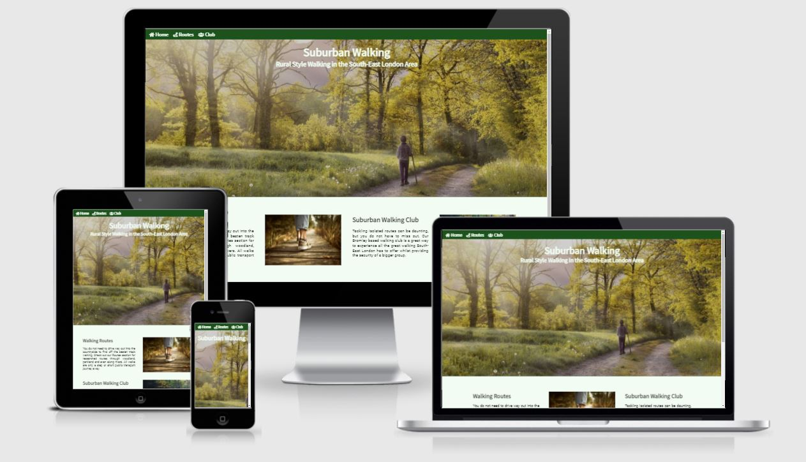
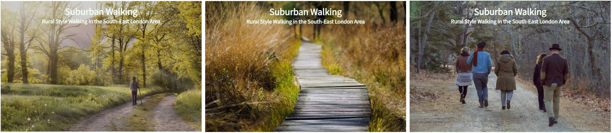
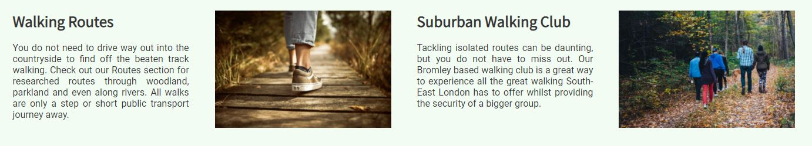
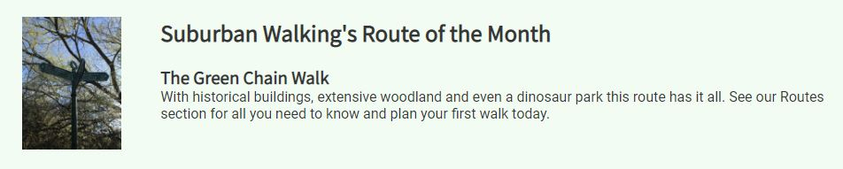
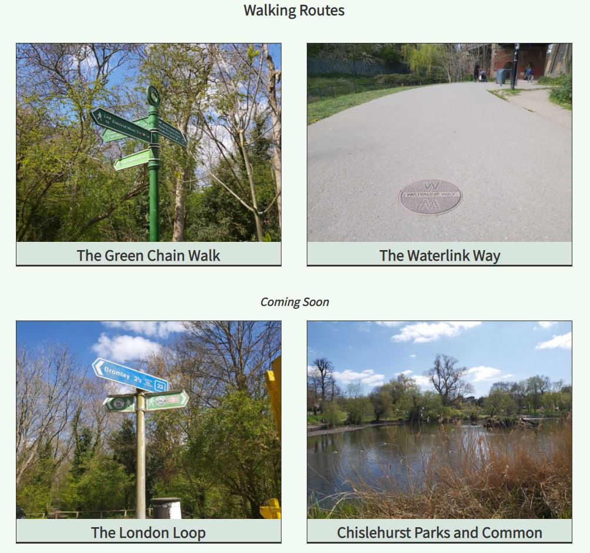
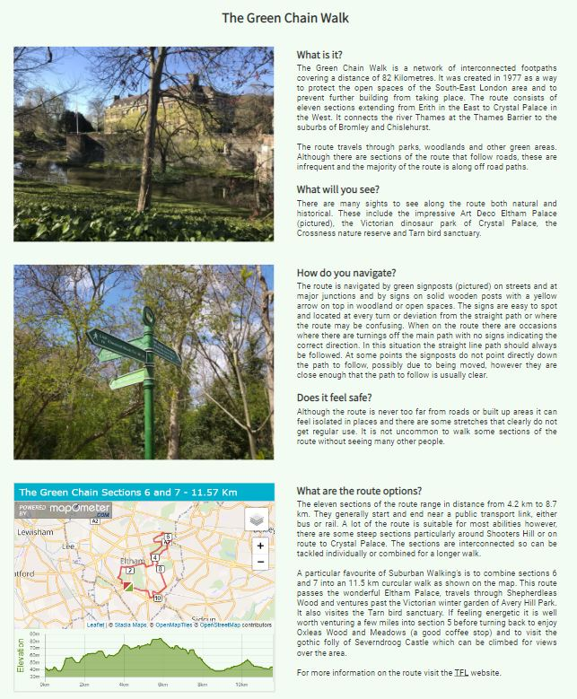
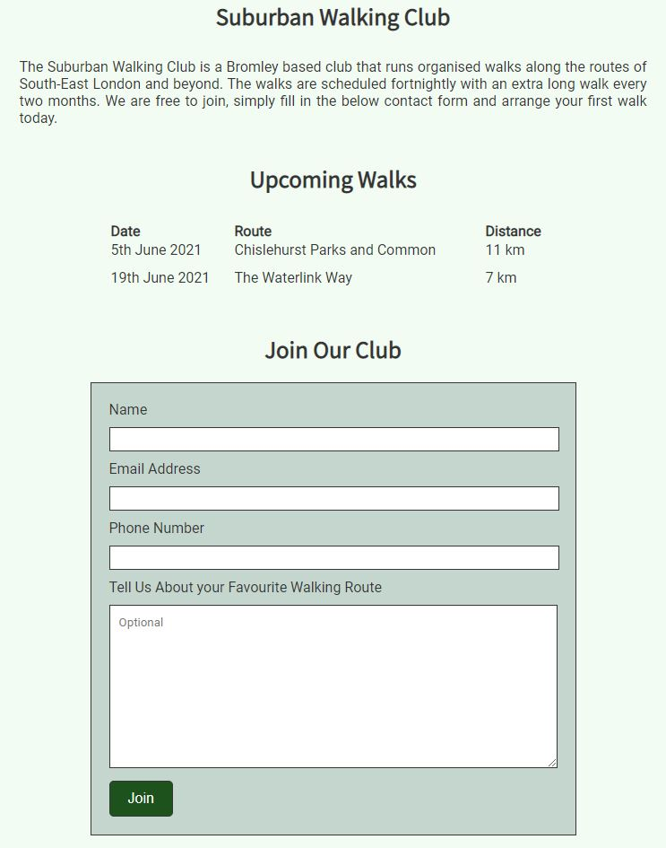

# Suburban Walking

This is a website providing information on walking routes in the South-East London area. In recent times due to the many lockdowns people have not been able to travel far and have come to rely on and appreciate what their local area has to offer. This website provides information on walking routes in suburban areas that are off the beaten track and feel rural in nature. The site is targeted both towards regular walkers who may normally travel to the countryside and are looking for new route options and new walkers looking to try their first route. Some of the routes are quite isolated and may be daunting to tackle alone. The website also provides a local walking club so that, particularly new walkers, can investigate the routes in the company of others.

[The live project can be found here.](https://stephanie-ash.github.io/suburban-walking/)

## Features

### Existing Features

* **Navigation Bar**
    * The navigation bar is found on all pages for easy navigation to the important parts of the site without using the browser navigation buttons.
    * It is identical and in the same location on all pages making it easy for the user to locate.
    * It is intended that that site will expand over time with additional walking routes added. A summary Routes page is therefore linked to on the navigation bar instead of individual routes to avoid the navigation bar becoming too busy and confusing.

* **Hero Images**
    * The main page images for each section of the site are appropriate for the section in question and give a visual representation of what the page covers.
    * The images occupy the same space on each page and all show the main heading and tagline thus providing consistent design across the site.
    * All images are consistent with the theme and purpose of the site.

* **Site Introduction Section**
    * The homepage site introduction section introduces the two functions of the site.
    * It quickly let's the user know the purpose of the site and the information it provides, and encourages the user to explore further.
    * The links provide easy access to the other parts of the site.

* **Route of The Month Section**
    * This section provides an introduction to one of the walking routes detailed on the site.
    * It catches the users attention and sparks their interest. It also shows that the site is frequently updated ensuring return visits.

* **Route Pointers**
    * The route pointers page provides navigation links to the various walking routes pages.
    * It allows the user to easily navigate to the route they are interested in. It also provides a teaser of future content.
    * Having a dedicated routes page avoids clutter on the homepage as the site expands and more routes are added.

* **Route Pages**
    * The individual route pages provide information about specific routes.
    * They are laid out in sections so that the user can easily search out the information they require.
    * The images provide added context and the embedded map can be used by the user when walking a route.

* **Club Page**
    * The club page allows the user to find out useful information about the walking club and to sign up.
    * The user will be asked to submit their name, email address and phone number. They also have the option to suggest a walking route allowing the site owner to collect ideas for possible new routes to add to the site.

* **The Footer**
    * The footer section provides links to the social media sites for Suburban Walking.
    * It is located at the same place on every page making it easy to find and the links open in a new tab providing easy navigation for the user.
    * The footer encourages the user to keep updated on the site via the social media pages and so encourages continued engagement.

* **Colour Scheme**
    * Various shades of green have been used throughout the site to reflect the natural world and to tie in with the theme of the site, that being the idea of rural style walking.

### Features Left to Implement

* **Interactive and Customizable Maps**
    * In the future more complex interactive maps could be added which allow the user to choose from a list of plotted walking routes.
    * The user would be able to edit or combine the plotted routes to create their own custom route.
    * Step by step instructions on how to navigate the route could also be provided.

### User Stories
  1. As someone new to walking, I want to find clear information about interesting routes with details on how they can be adapted for various abilities.
      * Upon entering the site the user is greeted with a clear homepage with an easily found navigation bar providing quick access to the routes page. The routes page can also be navigated to via the introductory text.
      * The Routes page clearly sets out the routes available and provides easy linked navigation for more information on the selected route.
      * The route description pages are simply laid out with headings describing what each section of text covers. Details of difficulty plus suggested adaptations and a mapped route suggestion are provided along with links to external sites providing more information.
  2. As a female on her own interested in taking up walking for exercise I want to find information about walking routes, but reassurance that I will feel safe.
      * The walking club introduction on the homepage alerts the user to the fact that safety is a consideration of the site. It provides an option they may not have considered giving a reason for future visits to the site.
      * 'Will I feel Safe?' sections are provided on both route pages drawing the user attention to the information they require.

  3. As a regular walker, I want to quickly find information about interesting routes, so that I can try them out. I want to find social media links so that I can keep track of when new routes are added.
      * The navigation features already described allow the user to easily access the information they require.
      * Social media links are found in the footer of every page and will open on a new page allowing the user to navigate to the social media pages.
      * The suggested 'Walk of the Month' on the homepage tells the user that the site is regularly updated and gives an incentive for a return visit. The 'Coming Soon' section of the Routes page provides a teaser of what is to come and also provides incentive for a return visit.

### Wireframes

* Desktop view wireframes
    * Homepage - [View](wireframes/suburban-walking-home-desktop.jpg)
    * Routes - [View](wireframes/suburban-walking-routes-desktop.jpg)
    * Individual route page - [View](wireframes/suburban-walking-individual-route-desktop.jpg)
    * Club - [View](wireframes/suburban-walking-club-desktop.jpg)

* Mobile view wireframes
    * Homepage - [View](wireframes/suburban-walking-home-mobile.jpg)
    * Routes - [View](wireframes/suburban-walking-routes-mobile.jpg)
    * Individual route page - [View](wireframes/suburban-walking-individual-route-mobile.jpg)
    * Club - [View](wireframes/suburban-walking-club-mobile.jpg)

## Testing

* Continuous testing was carried out throughout the development process with display or functionality errors corrected as they appeared.
* The header title text was redesigned after it was discovered the initial absolute placement in relation to the hero image resulted in the text disappearing on smaller screens.
* The site was viewed and tested on the Google Chrome, Microsoft Edge, Internet Explorer and Safari browsers.
* The site was tested on various screen sizes using the Chrome Developer tools.
    * The inline block style of wider screens, with text displayed alongside images reverts to text below images block style on smaller screens.
    * Media queries have been added to ensure the site displays well at the transition points between the two styles.
* Friends and family members were asked to review the site on various mobile devices to determine if the site was suitably responsive.
    * The iframe maps were discovered to extend beyond the screen due to the fixed width in the html iframe code and this was updated to be more responsive.

### Validator Testing

* HTML
    * When pasing the individual routes pages through the [W3C validator](https://validator.w3.org/) issues were identified with the iframe maps. These have been solved by moving some of the iframe styling to the CSS stylesheet.
    * No errors are now returned for all pages.
* CSS
    * No errors have been found when passing through the [Jigsaw validator](https://jigsaw.w3.org/css-validator/)

### Unfixed Bugs

* HTML and CSS do not allow for the creation of a database to receive form information. The club page currently submits the form information to the code institue form dump.

## Deployment

The project was deployed to GitHub Pages. The following steps are used to deploy the site:
* Navigate to Github and locate and select the GitHub repository.
* Navigate to the settings tab and select the 'Pages' tab from the menu.
* Under 'Source' click the dropdown labelled 'None' and select the 'master' branch.
* Click save. The page will automatically refresh and the published site link can be found on the 'Pages' tab.
* The link can be found here - https://stephanie-ash.github.io/suburban-walking/

## Credits

### Content
* The 'Roboto' and 'Noto Sans JP' fonts were taken from [Google Fonts](https://fonts.google.com/).
* The icons in the nav bar and footer were taken from [Font Awesome](https://fontawesome.com/).
*  Instructions on how to use social media icons in the footer were taken from the Code Institute 'Love Running' walkthrough project.
* The walking route iframe maps were created using [mapometer](https://gb.mapometer.com/).
* Instructions on how to maje the textarea form input responsive were found [here](https://stackoverflow.com/questions/39068128/how-can-i-make-a-textarea-that-fits-within-the-width-of-the-current-viewport/39068155#:~:text=Set%20a%20max%2Dwidth%20on%20the%20element.&text=Try%20textarea%20%7Bmax%2Dwidth%3A,will%20always%20fit%20your%20display.&text=I%20set%20the%20number%20of,responsive%20to%20the%20screen%20size.)

### Media
* The homepage hero image was taken from [Pexels](https://www.pexels.com/)
* The Routes pages hero image was taken by Achim Bongard and found on [Pexels](https://www.pexels.com/).
* The club page hero image was taken by Bonnie Kittle and found on [Unsplash](https://unsplash.com/).
* The homepage routes introductory image was taken by Tobi and found on [Pexels](https://www.pexels.com/).
* The homepage club introductory image was taken by Ashim D'Silva and found on [Unsplash](https://unsplash.com/).
* All other photos are my own.
